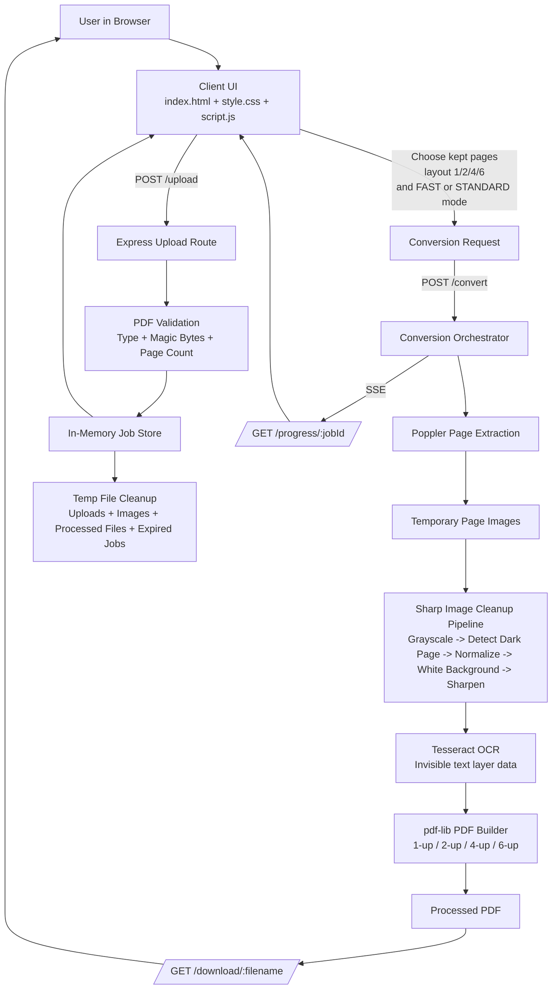

# Smart PDF Converter

Smart PDF Converter is a Node.js and vanilla JavaScript web application for cleaning dark-background PDFs and generating print-friendly white-background output.

It supports:

- dark-to-white PDF cleanup
- searchable OCR text in downloaded PDFs
- fast and standard processing modes
- page removal before conversion
- multi-sheet output layouts: 1-up, 2-up, 4-up, and 6-up
- real-time progress updates with SSE
- safe temporary-file handling and cleanup

The output is not a basic invert. Each page is processed to preserve readability while forcing the background toward clean white for printing.

## Tech Stack

### Frontend

- HTML5
- CSS3
- Vanilla JavaScript
- Native drag and drop
- Server-Sent Events for live progress

### Backend

- Node.js
- Express.js
- Multer
- pdf-poppler
- Sharp
- pdf-lib
- tesseract.js
- express-rate-limit
- uuid

## Features

- Upload PDF files up to 50 MB
- Validate PDF by type and magic bytes
- Add OCR text layer so downloaded PDFs are searchable and selectable
- Choose between `FAST` and `STANDARD` processing profiles
- Remove pages after upload before conversion
- Convert only the selected pages
- Export with 1, 2, 4, or 6 pages per sheet
- Live processing status with page counter and ETA
- Auto-clean temporary files after processing
- Download output using original filename format: `originalname_converted.pdf`

## How It Works

### User Flow

1. User uploads a PDF.
2. Server validates the file and counts pages.
3. Frontend shows a page editor where pages can be removed.
4. User selects output layout: 1-up, 2-up, 4-up, or 6-up.
5. User selects processing mode: `FAST` or `STANDARD`.
6. User starts conversion.
7. Server extracts PDF pages into images.
8. Each selected page is cleaned through the image-processing pipeline.
9. OCR extracts text from each cleaned page and embeds an invisible searchable layer.
10. Cleaned pages are reassembled into a PDF using the selected sheet layout.
11. User downloads the final PDF as `filename_converted.pdf`.

## Image Processing Pipeline

Each selected page goes through this pipeline:

1. PDF page is rendered to a high-resolution PNG using Poppler.
2. Image is converted to grayscale.
3. Page brightness is analyzed to detect dark-background pages.
4. Dark pages are negated before cleanup.
5. Median filtering reduces noise.
6. Histogram normalization expands contrast.
7. Histogram-based white-point detection pushes the background to white.
8. Text tones are preserved instead of forcing everything into binary black/white.
9. Final sharpening improves print readability.
10. OCR runs on the cleaned page image before PDF assembly so output remains searchable.

### Processing Diagram

```mermaid
flowchart LR
     A[PDF Page] --> B[Render to PNG\nvia Poppler]
     B --> C[Convert to Grayscale]
     C --> D[Measure Page Brightness]
     D --> E{Dark Background?}
     E -->|Yes| F[Negate Image]
     E -->|No| G[Keep Original Tone Direction]
     F --> H[Median Filter\nReduce Noise]
     G --> H
     H --> I[Normalize Histogram\nExpand Contrast]
     I --> J[Detect White Point]
     J --> K[Push Background to White]
     K --> L[Preserve Text / Gray Tones]
     L --> M[Sharpen for Print Readability]
     M --> N[Cleaned Page Image]
     N --> O[Tesseract OCR]
     O --> P[pdf-lib Layout Builder]
     P --> Q[Final Output PDF]
```



## Project Architecture

The application uses a simple two-layer structure:

- client: browser UI, upload flow, page editor, layout selection, SSE updates
- server: file validation, PDF processing, job tracking, output generation, downloads

### High-Level Architecture

```text
Browser
     |
     |-- GET / ----------------------------> static frontend
     |
     |-- POST /upload ---------------------> validate + save PDF + count pages
     |
     |<------------------------------- fileId, pageCount
     |
     |-- POST /convert --------------------> start job with kept pages + layout
     |
     |-- GET /progress/:jobId -------------> SSE progress stream
     |
     |<------------------------------- progress events
     |
     |-- GET /download/:filename ----------> download final PDF


Server internals
     upload PDF
          -> validate magic bytes
          -> count pages
          -> store job in memory
          -> extract page images with Poppler
          -> clean selected pages with Sharp
          -> build output PDF with pdf-lib
          -> store temporary processed file
          -> stream final download
```

### Mermaid Diagram



### System Architecture: How It Works

The system works as a request-driven pipeline where the browser handles interaction and the server handles all PDF processing.

#### 1. Frontend Boot

When the user opens the app, Express serves the static frontend files:

- `client/index.html`
- `client/style.css`
- `client/script.js`

The browser then initializes the upload UI, page editor state, layout controls, and progress listeners.

#### 2. Upload and Validation Layer

When a PDF is uploaded:

1. the browser sends the file to `POST /upload`
2. Multer stores the file in the temporary upload directory
3. the server validates:
     - MIME type
     - PDF magic bytes
     - page count limit
     - file size limit
4. the server creates an in-memory job entry
5. the client receives `fileId` and `pageCount`

At this stage, no conversion has started yet. The file is only validated and registered.

#### 3. Client-Side Editing Layer

After upload succeeds, the frontend enables three pre-processing controls:

- page removal editor
- layout selection: `1`, `2`, `4`, `6` pages per sheet
- processing mode selection: `FAST` or `STANDARD`

The page editor is browser-managed state. It does not rewrite the original PDF immediately. Instead, it stores which page numbers should be kept and sends that list to the server only when conversion begins.

#### 4. Job Start and Orchestration Layer

When the user clicks convert:

1. the browser sends `POST /convert`
2. request payload includes:
     - `fileId`
     - selected `layout`
     - `keptPages`
     - selected `mode`
3. the server validates the layout and selected pages
4. the server marks the job as `processing`
5. conversion starts asynchronously in the background

This separation is important because upload remains fast while the heavier processing runs independently.

#### 5. Progress Streaming Layer

The browser opens `GET /progress/:jobId` as an SSE connection.

This lets the server push live events such as:

- extraction started
- current page being processed
- percentage complete
- ETA
- assembly started
- completed or failed

This is why the UI can update progress without polling repeatedly.

#### 6. PDF Extraction Layer

On the server, the conversion job first uses Poppler to render the uploaded PDF into page images.

Responsibilities in this layer:

- create a temp image directory per job
- render all source pages as high-resolution PNG files
- sort extracted page files in original order
- filter only the pages selected by the user

This converts the PDF problem into an image-processing problem, which is easier to control precisely for background cleanup.

#### 7. Image Processing Layer

Each selected page image is processed one by one through Sharp.

This layer performs:

- grayscale conversion
- dark-page detection
- conditional negation for dark backgrounds
- noise reduction
- contrast normalization
- white-point detection
- background whitening
- text tone preservation
- sharpening

The result is a cleaned monochrome-style page image optimized for readability and printing.

#### 8. OCR Layer

After cleanup, the server runs Tesseract OCR on each processed page image.

This layer:

- uses the cleaned page image instead of the noisy source page
- applies explicit DPI metadata for more stable OCR behavior
- extracts word boxes and text values
- stores OCR data so it can be drawn back into the PDF as invisible text

#### 9. PDF Layout Assembly Layer

After all selected pages are cleaned and OCR data is collected, the server uses `pdf-lib` to generate the final PDF.

Depending on the selected layout:

- `1-up` creates one output sheet per input page
- `2-up` places two pages on one sheet
- `4-up` places four pages on one sheet
- `6-up` places six pages on one sheet using a `2 x 3` grid

This layer calculates page placement, scaling, margins, output sheet count, and invisible OCR text placement.

#### 10. Download Delivery Layer

Once assembly finishes:

1. the server saves the generated PDF in the processed output folder
2. the job record is updated with:
     - output filename
     - user-facing download filename
     - selected pages count
     - output sheet count
     - layout mode
3. the frontend shows the result screen
4. the browser downloads the file from `GET /download/:filename`

The download filename is derived from the original upload name in this format:

`originalname_converted.pdf`

#### 11. Cleanup Layer

The app uses temporary storage, so cleanup is a core architectural part of the system.

The cleanup routine periodically removes:

- expired uploaded PDFs
- expired processed PDFs
- extracted image folders
- old in-memory jobs

This prevents disk growth and stale job accumulation.

#### 12. Why This Architecture Works Well

This design is effective because responsibilities are clearly split:

- browser manages interaction and lightweight state
- server manages validation and heavy processing
- SSE provides live progress without polling overhead
- image-based processing gives precise control over dark background cleanup
- layout generation stays independent from page cleanup, so new layouts can be added without changing the cleanup algorithm

## File and Folder Structure

Current workspace structure:

```text
pdf-converter/
├── .gitignore
├── .vercelignore
├── client/
│   ├── favicon.svg
│   ├── index.html
│   ├── script.js
│   └── style.css
├── node_modules/
├── package-lock.json
├── package.json
├── README.md
├── server/
│   └── server.js
├── uploads/
└── vercel.json
```

### Runtime Folders

These folders are used by the app at runtime and are created automatically if needed:

```text
uploads/     -> temporary uploaded PDFs
processed/   -> generated output PDFs ready for download
images/      -> temporary extracted page images
```

## File-Level Architecture

### client/index.html

Primary UI shell.

Responsibilities:

- upload drop zone
- file info panel
- page editor section
- layout selector section
- processing mode selector section
- processing view
- download/result view

Key UI sections:

- upload area
- page editor after upload
- output layout selector
- fast/standard mode selector
- progress ring and logs
- download stats and action buttons

### client/style.css

Visual system for the app.

Responsibilities:

- dark technical HUD design
- responsive layout
- upload card styling
- page chip styling for page removal
- layout selector styles
- processing and download section styling

### client/script.js

Frontend application controller.

Responsibilities:

- drag-and-drop file selection
- upload request handling
- page editor state management
- kept-page selection logic
- layout selection handling
- processing mode selection handling
- conversion request dispatch
- SSE progress handling
- result rendering and download wiring
- reset and recovery flow

Core client state includes:

- uploaded file id
- selected file reference
- total uploaded pages
- selected pages to keep
- selected output layout
- selected processing mode
- current SSE connection

### server/server.js

Single backend entrypoint and processing engine.

Responsibilities:

- Express server setup
- static file serving
- upload validation
- page counting
- in-memory job tracking
- SSE progress emission
- page image processing pipeline
- OCR extraction and invisible text overlay generation
- output PDF generation for 1-up, 2-up, 4-up, 6-up
- safe download response naming
- periodic cleanup of temporary files
- Vercel-safe temp path selection and lazy dependency loading

Important server functions:

- `validatePdfMagic(filePath)`
     checks PDF magic bytes

- `countPdfPages(filePath)`
     reads page count using pdf-lib

- `getProcessingProfile(mode)`
     returns processing parameters for `FAST` or `STANDARD`

- `processPageImage(inputPath, profile)`
     cleans one rendered PDF page image and prepares OCR-friendly output

- `extractOcrWords(worker, imageBuffer)`
     extracts OCR text and word boxes from a processed page image

- `drawOcrTextLayer(page, ocrWords, placement, sourceSize, font)`
     overlays invisible searchable text in the output PDF

- `getLayoutConfig(pagesPerSheet)`
     returns grid layout for 1, 2, 4, or 6 pages per sheet

- `buildOutputPdf(processedImages, pagesPerSheet)`
     assembles cleaned page images and OCR text into the final PDF layout

- `convertPdf(jobId, inputPath, originalName, pagesPerSheet, keptPages, mode)`
     full conversion orchestration pipeline

- `buildDownloadFileName(originalName)`
     generates `filename_converted.pdf`

## API Architecture

### POST /upload

Uploads and validates a PDF.

#### Request

- content type: `multipart/form-data`
- field name: `pdf`

#### Response

```json
{
     "fileId": "uuid",
     "fileName": "chapter1.pdf",
     "fileSize": 1827364,
     "pageCount": 14,
     "message": "Upload successful. Ready to convert."
}
```

### POST /convert

Starts background conversion for a previously uploaded PDF.

#### Request

```json
{
     "fileId": "uuid-from-upload",
     "layout": 4,
     "keptPages": [1, 2, 5, 7, 8],
     "mode": "fast"
}
```

#### Notes

- `layout` supports `1`, `2`, `4`, `6`
- `mode` supports `fast` or `standard`
- `keptPages` is optional
- if `keptPages` is omitted, all pages are converted

#### Response

```json
{
     "jobId": "uuid",
     "layout": 4,
     "mode": "fast",
     "message": "Conversion started."
}
```

### GET /progress/:jobId

SSE endpoint for live progress updates.

#### Example event

```json
{
     "status": "processing",
     "page": 3,
     "total": 8,
     "percentage": 42,
     "eta": 12,
     "message": "Processing page 3 of 8"
}
```

#### Completion event includes

```json
{
     "status": "complete",
     "outputFile": "uuid-filename_converted.pdf",
     "downloadName": "filename_converted.pdf",
     "originalPageCount": 10,
     "selectedPages": 8,
     "outputPages": 2,
     "layout": 4,
     "mode": "fast"
}
```

### GET /download/:filename

Streams the processed PDF to the browser.

Behavior:

- serves the final PDF
- sets download filename to `originalname_converted.pdf`
- removes temp file shortly after download

## Data Flow Details

### Upload Phase

- file stored in `uploads/`
- page count extracted
- job stored in memory with file metadata

### Editing Phase

- frontend renders page buttons based on page count
- user toggles pages on or off
- frontend submits kept page numbers, selected layout, and selected processing mode

### Conversion Phase

- server renders all pages to images
- server filters only selected pages
- selected pages are cleaned one by one
- OCR runs on cleaned page images
- server assembles the final output layout

### Download Phase

- output written to `processed/`
- browser downloads with original-based filename
- temp file is deleted after download

## Layout Logic

Supported output layouts:

- `1-up`: 1 original page on 1 output sheet
- `2-up`: 2 original pages on 1 output sheet
- `4-up`: 4 original pages on 1 output sheet
- `6-up`: 6 original pages on 1 output sheet using a `2 x 3` grid

Example:

- input PDF pages kept: 11
- layout selected: 6-up
- output PDF sheets: `ceil(11 / 6) = 2`

## Security and Validation

- PDF MIME-type validation
- PDF magic byte validation
- sanitized uploaded filenames
- sanitized download naming
- directory traversal protection in download route
- rate limit: 10 conversions per hour per IP
- no script execution from uploaded files
- controlled failure if Poppler or OCR runtime dependencies are unavailable

## Cleanup Strategy

The server periodically deletes old temp files and expired jobs.

Cleanup covers:

- uploaded PDFs
- processed PDFs
- extracted page image folders
- stale in-memory jobs

Default cleanup window:

- files older than 1 hour are removed
- cleanup runs every 30 minutes

## Installation

```bash
npm install
```

## Prerequisites

### Node.js

- Node.js 16+

### Poppler

`pdf-poppler` requires Poppler binaries to be available on the machine.

### OCR Runtime

`tesseract.js` is installed with the app and runs during conversion to make output PDFs searchable.

Notes:

- OCR increases conversion time compared with image-only output
- `FAST` mode uses lower OCR DPI for better speed
- `STANDARD` mode uses higher OCR DPI for better recognition quality

#### Windows

1. Download Poppler from:
      `https://github.com/oschwartz10612/poppler-windows/releases`
2. Extract it, for example to:
      `C:\poppler`
3. Add this to your PATH:
      `C:\poppler\Library\bin`

#### macOS

```bash
brew install poppler
```

#### Ubuntu or Debian

```bash
sudo apt-get install poppler-utils
```

## Running the App

### Production

```bash
npm start
```

### Development

```bash
npm run dev
```

Open:

```text
http://localhost:3000
```

## Deployment Notes

The repository includes `vercel.json` and `.vercelignore`, and the server exports the Express app in a serverless-friendly way.

Important caveat:

- Vercel is not an ideal production target for this app because `pdf-poppler` depends on native Poppler binaries that are typically unavailable in serverless runtimes
- the app can fail gracefully when Poppler or OCR dependencies are missing, but conversion itself still requires those binaries to exist
- for reliable production deployment, use a host that supports native binaries and persistent temp storage, such as Render, Railway, or a VM/container platform

## package.json Scripts

- `npm start` -> runs `node server/server.js`
- `npm run dev` -> runs `npx nodemon server/server.js`

## Limitations

- page thumbnails are not rendered yet in the editor; page selection is number-based
- job state is stored in memory, so restarting the server clears active jobs
- very large PDFs may take time because each page is rendered, cleaned, OCR-processed, and rebuilt as an image-based PDF
- Vercel deployment is limited by Poppler binary availability

## Troubleshooting

| Problem | Cause | Fix |
|---|---|---|
| Upload rejected | Not a valid PDF | Check file type and magic bytes |
| Conversion fails immediately | Poppler not installed or not in PATH | Install Poppler and restart terminal/server |
| Conversion returns OCR dependency error | OCR runtime failed to initialize | Restart the server and verify dependency install completed successfully |
| Conversion is slow | High-resolution rendering, cleanup, and OCR are all active | Use `FAST` mode for quicker output |
| Repeated DPI warnings in terminal | OCR inferred bad image DPI metadata | Update to the latest server code and restart the server |
| Blank or weak output | Source page may already be very light | Try a darker-background source PDF to validate behavior |
| No download file | Temp file may already be cleaned up | Re-run conversion and download immediately |
| Wrong page count after editing | Some pages were removed intentionally | Check the page editor summary before converting |

## Future Improvements

- thumbnail-based page preview editor
- drag-to-reorder pages before conversion
- downloadable job history
- cancel active conversion job
- per-layout preview before processing
- optional OCR toggle for faster non-searchable output

## License

MIT
